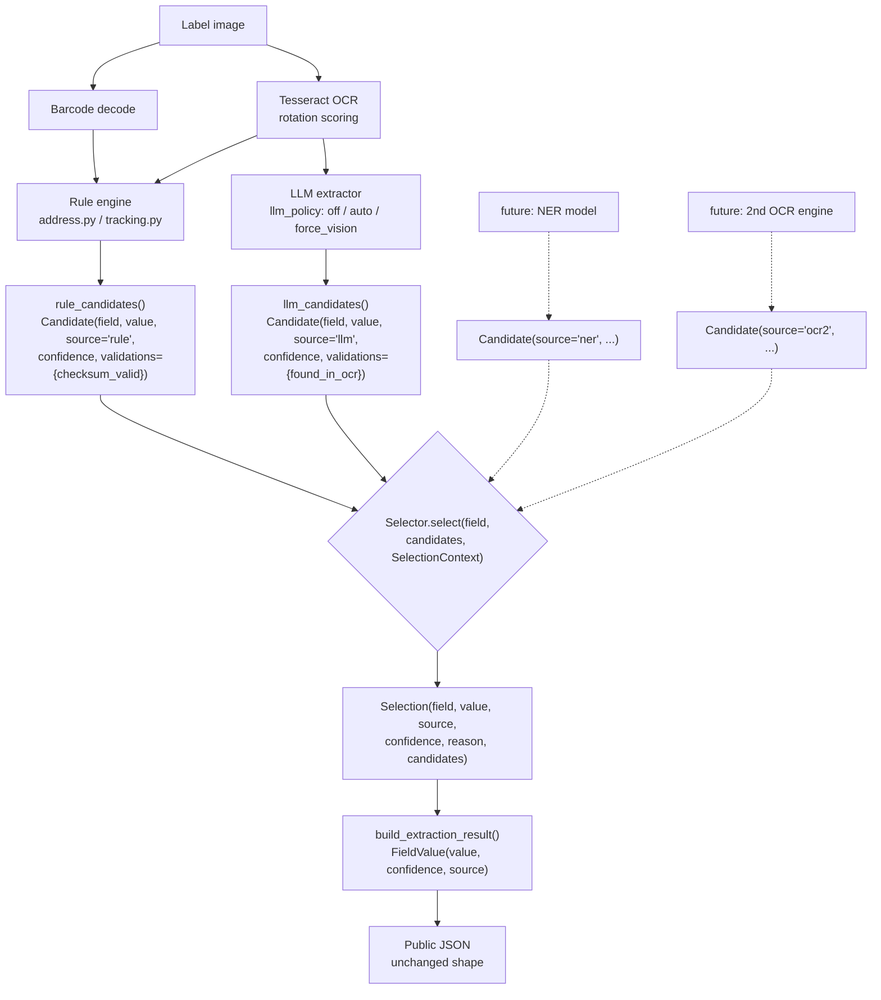

# Candidate / Selector Architecture

Introduced in Week 2. Every extraction source produces `Candidate` objects;
the `Selector` arbitrates exactly one `Selection` per field. Sources never
encode selection policy; the policy never knows how a value was produced.

## Data flow

## Objects (`selection.py`)

| Object | Role |
|---|---|
| `Candidate` | One source's proposal for one field: `field`, `value`, `source`, `confidence`, `validations` (name → bool/None), optional `reason`. Empty values are legitimate candidates ("this source found nothing"). |
| `Selection` | The arbiter's per-field decision: value, legacy source label (`rule_based`/`llm`/`agreement`), confidence, human-readable `reason`, and the full candidate list for observability. |
| `SelectionContext` | Per-scan signals the policy may consult (currently `llm_mode`). |
| `Selector` | The policy. The current implementation is **legacy-parity**: it reproduces the historical selection rules exactly. |

## Current policy (legacy-parity)

1. Rule value blank + LLM produced a value → LLM (`rule_blank_llm_fill`)
2. `llm_mode == "vision"` + LLM value + normalized disagreement → LLM
   (`vision_conflict_override`; `vision_fallback` mode does not qualify)
3. Otherwise the rule value wins — `agreement` when normalized values match
   (including both-empty), else `rule_based` (`rule_llm_agree` / `rule_default`)

Candidates from unknown sources are ignored by this policy, deliberately:
adding a source cannot change behavior until a policy for it is written.

## Extension contract — adding a source

1. Produce `list[Candidate]` / `dict[field, Candidate]` with a new `source`
   name and a calibrated `confidence`; attach format checks to `validations`.
2. Append them to `field_candidates` in `pipeline.run()` (one line).
3. Write the policy: either extend `Selector` or add an alternate Selector
   class and swap `pipeline._selector`.

Nothing else changes: `Selection` shape, `build_extraction_result`, storage,
and the public JSON are all source-agnostic.

## What plugs in next (out of scope this sprint)

- **Calibrated confidence**: replace hand-set constants with
  `P(correct | source, validations)` fitted from the annotated DB; the
  Selector then ranks by calibrated confidence instead of legacy rules.
- **NER model**: `ner_candidates()` from the DistilBERT token classifier.
- **Additional OCR engines / LLM providers**: more candidate builders;
  provider identity travels in `Candidate.source`/`reason`.
- **Validation rules**: ZIP↔state cross-checks etc. land in
  `Candidate.validations` and become selector inputs.

## Guardrails

- `tests/test_selection.py` — unit tests of the policy branches.
- `tests/test_selection_parity.py` + `tests/golden/selection_parity.json` —
  27 golden cases (9 carrier-mixed images × off/auto/force_vision with a
  deterministic LLM stub) that the public JSON must match byte-for-byte.
  Regenerate deliberately with `--regen` only when an output change is
  intended and reviewed.
- `regression_test.py` — field-accuracy ratchet, unchanged.
